# Simple Node Application Using CI/CD Pipeline

🚀 Sample Node Hello World Application Using CI/CD Pipeline (GitHub Actions).

Deploying The Application locally on minikube ☸.

## Table of Contents

- [Simple Node Application Using CI/CD Pipeline](#simple-node-application-using-cicd-pipeline)
  - [Table of Contents](#table-of-contents)
  - [🛠️ Prerequisites](#️-prerequisites)
  - [Introduction](#introduction)
  - [Usage and Setup Instructions:](#usage-and-setup-instructions)
  - [Application Setup](#application-setup)
  - [CI Pipeline](#ci-pipeline)
    - [Inside The `ci.yml` file](#inside-the-ciyml-file)
    - [The pipeline should automate the following](#the-pipeline-should-automate-the-following)
  - [Deployment](#deployment)
    - [Deploy the application using Terraform](#deploy-the-application-using-terraform)
  - [Monitoring and Logging](#monitoring-and-logging)
  - [Questions or Need Help?](#questions-or-need-help)

## 🛠️ Prerequisites

    - Docker  🐋
    - Kubectl ☸
    - minikube ☸
    - Terraform 🏗️

## Introduction

👋 Welcome to the Sample Node App! In this project we will Dockerize the provided node app, and deploy it on a cluster using The CI/CD pipeline GitHub Actions.

## Usage and Setup Instructions:

Clone the repository using the following command:

```linux
    https://github.com/Hendawyy/Sample-nodejs-app-GithubActions-Deploy-Locally.git
```

## Application Setup

1. **Fork the Repository:**
   - Fork the provided simple web application [repository](https://github.com/johnpapa/node-hello) (e.g., a basic "Hello World" app in Node.js) 🍴.

2. **Containerize the Application:**
   - Create a Dockerfile 🐋 for containerizing the application.

## CI Pipeline

Set up a CI/CD pipeline using GitHub Actions.

1. You need to create a directory `.github/workflows` and add your CI/CD configuration file.

    ```linux
        mkdir -p .github/workflows
    ```

2. Create the configuration file and name it whatever, I named it `ci.yml`.

    ```linux
        cd .github/workflows/
        touch ci.yml
    ```

### Inside The `ci.yml` file

- Name your pipeline like this:

     ```yaml
            name: CI Pipeline
    ```

- Specify The triggering conditions for running the workflow (e.g., push or pull request) and you will also need to specify the branch.

    ```yaml
        on:
        push:
            branches: [master]
        pull_request:
            branches: [master]
    ```

- Then you need to specify the key `jobs` then name your `job` and add the `steps` for this job.

### The pipeline should automate the following

- Linting the code.
  - Add The Job and push which will trigger the workflow to run .
  - Create a file named .eslintrc.js and add some rules for the linter to check on.

    ```linux
        cd ../..
        touch .eslintrc.js
    ```

  - Add Some Rules.

    ```
        module.exports = {
        extends: 'eslint:recommended',
        env: {
            node: true,
        },
        rules: {
            'indent': ['error', 2],
            'semi': ['error', 'never'],
            'quotes': ['error', 'single'],
            'comma-dangle': ['error', 'always-multiline'],
            'keyword-spacing': ['error', { 'before': true, 'after': true }],
        
        },
        };
    ```

  - As we Can See The Job ran error-free.
    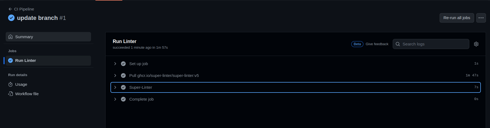

> [!NOTE]
> I used the `Super Linter` action which is available in marketplace.

- Building the Docker container.
- Pushing the container to a container registry (Docker Hub)
  - Now, For this job , I'll make another job Called Docker.
  - I'll use another Action called `mr-smithers-excellent/docker-build-push@v4`.
  - So I'll First add my Docker username and password on gihub secrets you can find a tab called settings on the repo.
  - On the sidebar you will find `Secrets and Variables` accordion and choose `Actions`.
  - You will press `New Repository Secret` and add 2 secrets your `Dockerhub Username` is one and the second is you `Dockerhub Password`.
  - Now, I will add the `job` and specify the image like this `my-username/image-name`.
  - Specify `tag` if desired and you registry should be `docker.io`.

```yaml
    - name: Build and Push Docker Image
      id: docker_build
      uses: mr-smithers-excellent/docker-build-push@v4
      with:
        image: ${{ secrets.DOCKER_USERNAME }}/nodejs-img
        tag: v1
        registry: docker.io
        username: ${{ secrets.DOCKER_EMAIL }}
        password: ${{ secrets.DOCKER_PASSWORD }}
```

- As we Can See The Job ran error-free.
      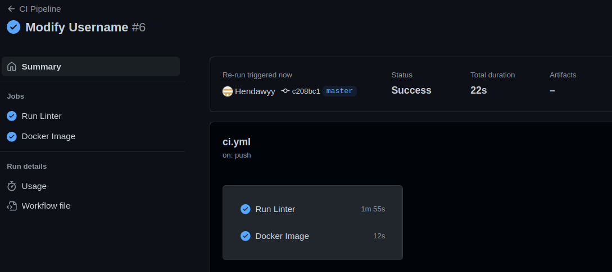
- And here is the pushed image on DockerHub.
      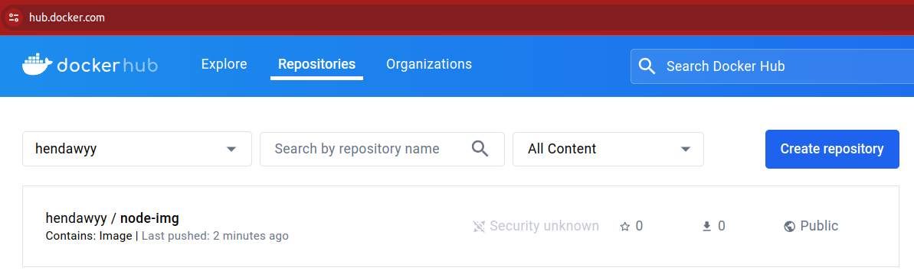

## Deployment

### Deploy the application using Terraform

1. You need to create a directory `Terraform` and add your `tf` configuration files.

     ```linux
        mkdir Terraform
    ```

2. Create the configuration file and name it `main.tf`, `provider.tf`, `variables.tf`.

    ```linux
        cd Terraform/
        touch main.tf provider.tf variables.tf
    ```

- inside the `provider.tf` specify docker as the provider.
- inside the `variables.tf` specify The image you need to be pulled and the ports.
- inside the `main.tf` define the resources needed to ensures that the Docker image is pulled (if not already present).
- Run the container locally using the docker provider.
  - Inside the `ci.yml` add the `terraform job` and make sure to add the `needs` key to make sure that the job runs after pushing the docker image on `Dockerhub`.
  - Then you add the terraform commands to apply the `tf` configuration files.  

    ```yaml
     Terraform:
        name: Terraform Deployment
        runs-on: ubuntu-latest
        needs: Docker
    ```

- As we Can See The Job ran error-free.
    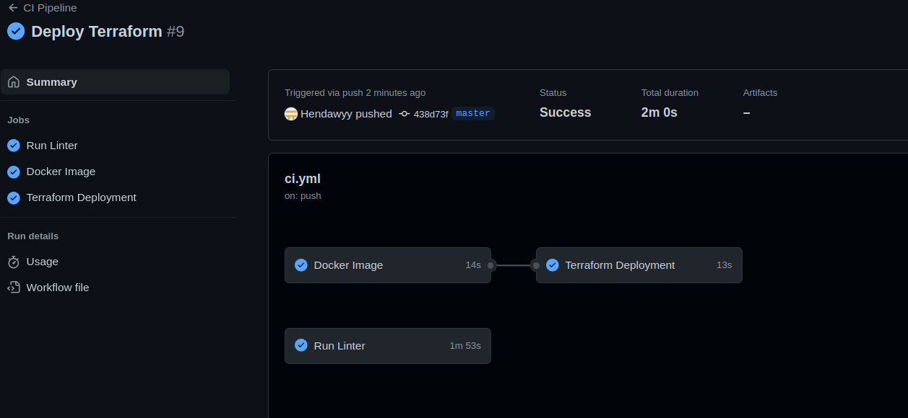

> [!NOTE]
> You will find the full job in `.github/workflows/ci.yml` file.

- Deploy the container on a container orchestration platform (e.g. minikube).
      - You need to create a directory `Kubernetes` and add your `yaml` files.

```linux
    mkdir Kubernetes
```

    ```linux
        cd Kubernetes/
        touch '1 namespace.yaml' '2 deployment.yaml' '3 service.yaml'
    ```

- inside the `1 namespace.yaml` Create a namespace where our deployment will be.
- inside the `2 deployment.yaml` Create a deployment of the node image with 3 replicas.
- inside the `service.yaml` Create a NodePort service for our app to be able to access it.
  
  - Inside the `ci.yml` add the `Kubernetes job` and make sure to add the `needs` key to make sure that the job runs after pushing the Terraform resource have been applied.
  - Then you apply the `yaml` configuration files.  
  - As we Can See The Job ran error-free.
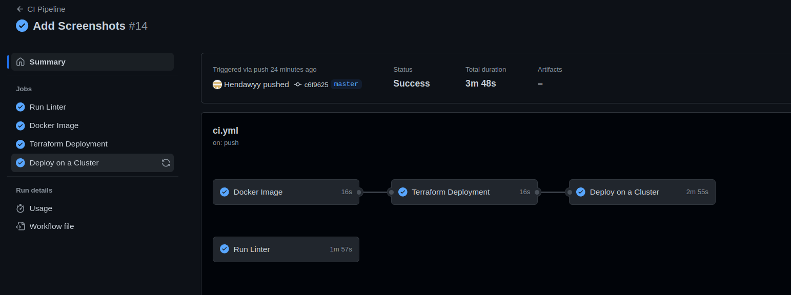
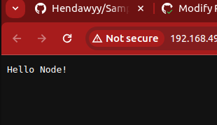
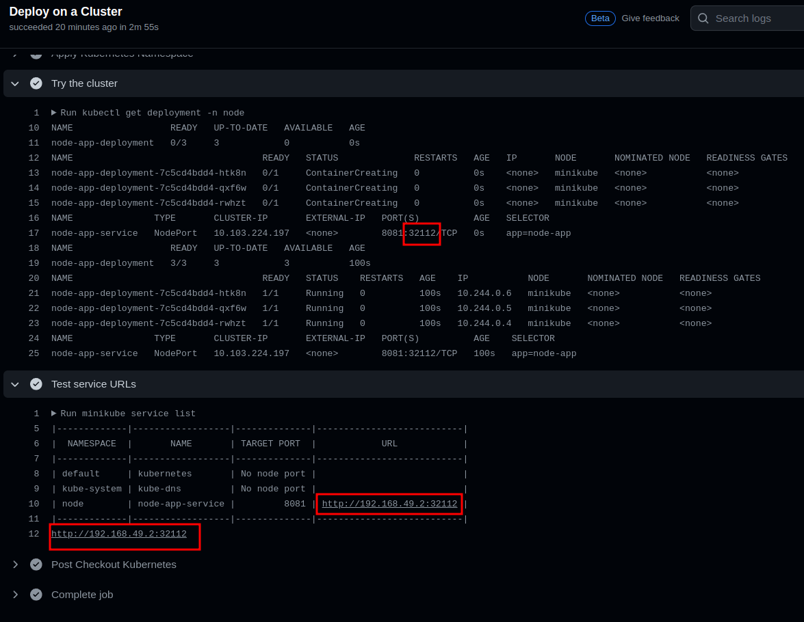

## Monitoring and Logging

To Set up log aggregation for the application using the free tier on New Relic.

- You need to go to this link [NewRelic](https://newrelic.com/platform/log-management?gclid=true).
- Enter your name and mail to get started for free.
- After you login choose Kubernetes and then Guided CLI install.
- You will be provided with a command for Installing the Kubernetes Integration.
- Copy this command and paste it inside your terminal.
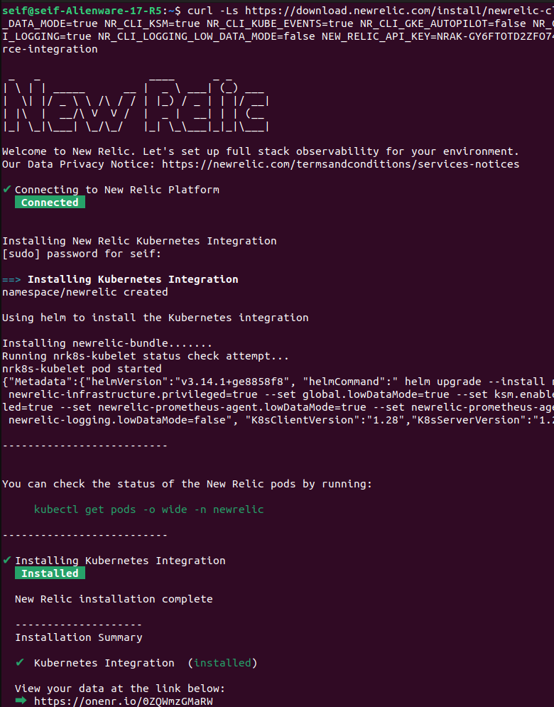
- Then you will need to test the connection if it succeed you will be able to See your data.
- you will find the Terminal looking like this.
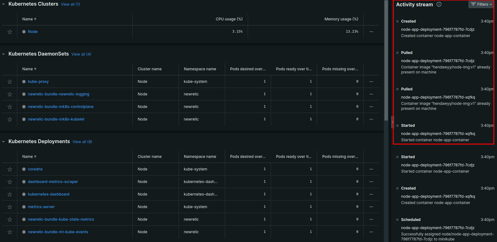
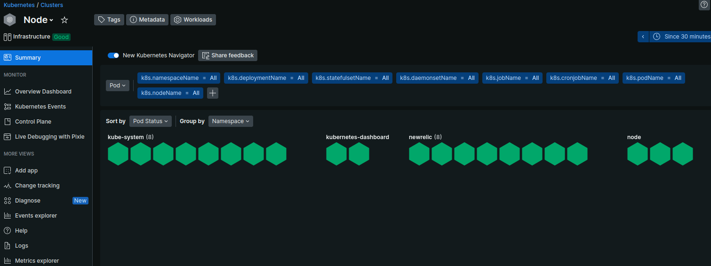
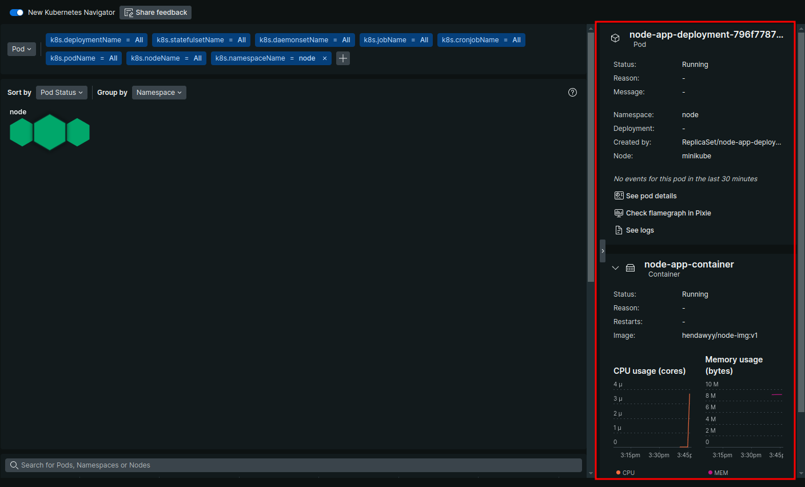
  
## Questions or Need Help?

If you have any questions, suggestions, or need assistance, please don't hesitate to Contact Me [Seif Hendawy](mailto:seifhendawy1@gmail.com). 😉
